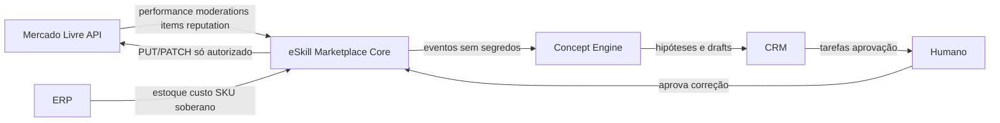
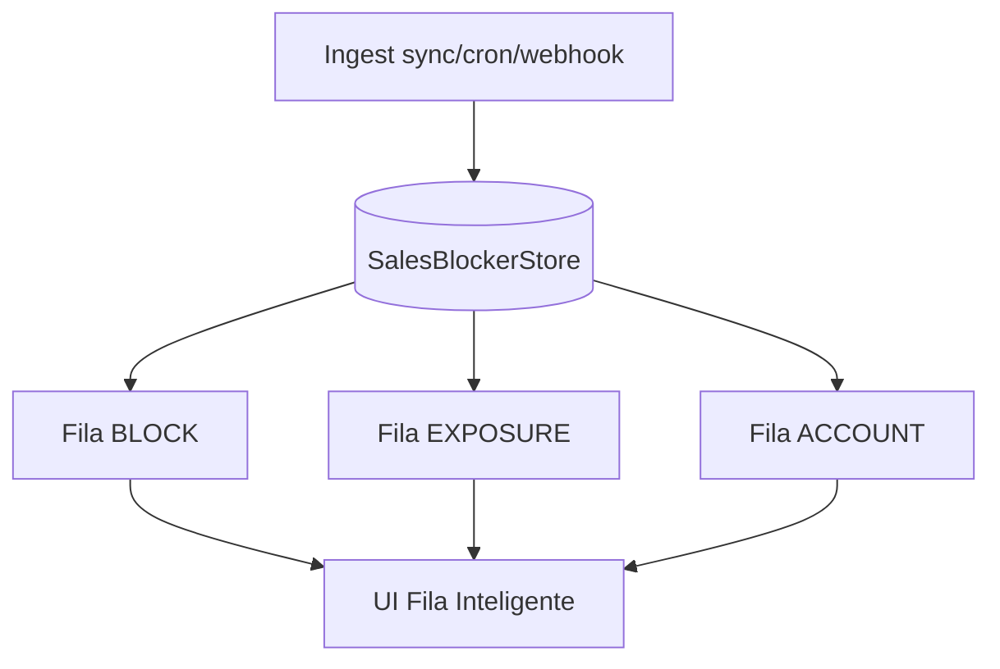

# Mapa de Integração — Bloqueios de Venda e Alavancagem ML

**Documento:** ARCH-ML-SB-001
**Versão:** 1.0
**Status:** Proposto
**Data:** 17/07/2026
**Plano pai:** [PLAN_MOTOR_IRREGULARIDADES_CONVERSAO_V1.md](../product/PLAN_MOTOR_IRREGULARIDADES_CONVERSAO_V1.md)

---

## 1. Visão dos sistemas

---

## 2. eSkill — papéis

| Papel | Responsabilidade |
|-------|------------------|
| Coletor | Sync items, orders, questions, webhooks |
| Detector | Moderations + performance + reputation signals |
| Executor | Ações ML **somente** após aprovação |
| Provedor | API/eventos internos para Concept Engine |

**Já reutilizável (código real):**
- `MercadoLivreClient::getItemPerformance` / `getItemHealth`
- `MercadoLivreClient::getLastModeration` / `getInfractions` / `diagnosePicture`
- `MercadoLivreClient` items/search
- `ListingIrregularityScanService` + `ListingSearchVisibilityService` + `ListingVisibilityController` (UI/API read-only)
- `AccountHealthService` (pilares; under_review count)
- `ItemMetricsService`
- `CompatibilityController` / `BulkCompatibilityController`
- `AuditLogService`
- Webhooks de items (ingress)

**Não reutilizar para este foco:**
- Clone* (31 services)
- AutoPricing / DynamicPricing execução
- AdsWizard execução automática
- AutonomousAgent / Decision engines
- Canais Shopee / WhatsApp / Brevo / OpenClaw

---

## 3. APIs ML a integrar (Fase 2+)

| Prioridade | Método | Path | Uso |
|------------|--------|------|-----|
| P0 | GET | `/users/{user_id}/items/search?status=under_review` | Lista bloqueados |
| P0 | GET | `/users/{user_id}/items/search?status=paused&tags=moderation_penalty` | Pausas preventivas |
| P0 | GET | `/moderations/last_moderation/{item_id}-ITM` | reason + remedy |
| P0 | GET | `/moderations/infractions/{user_id}` | Histórico / subgroup |
| P0 | GET | `/item/{id}/performance` | Score + buckets (já existe client) |
| P1 | GET | `/users/{user_id}` | seller_reputation |
| P1 | GET | Compatibilidades autopeças | Cobertura Facility |
| P2 | POST | `/moderations/pictures/diagnostic` | Prevenir moderação de foto |

`moderation_reference_id` = `{ITEM_ID}-ITM` (sufixo ITM para publicações).

---

## 4. Filas internas

| Fila | Critério | SLA sugerido |
|------|----------|--------------|
| BLOCK | under_review, paused+moderation_penalty, DENYLIST | &lt; 1h triagem humana |
| EXPOSURE | performance WARNING, poor_quality_thumbnail, score baixo | diário |
| ACCOUNT | claims/cancel/delay acima do Green MLB | diário |

---

## 5. Banco (proposta — não criar agora)

Tabelas futuras (após aprovação + migration dedicada):

- `ml_listing_moderations` — snapshot da última moderação por listing
- `ml_listing_performance_snapshots` — score, level, top rules
- `ml_account_reputation_snapshots` — métricas de reputação
- `ml_irregularity_sync_runs` — auditoria de sync

Todas com `organization_id` / `account_id` alinhados a SEC-001/ADR-001.

---

## 6. Redis

| Chave | TTL | Uso |
|-------|-----|-----|
| `irr:mod:{account}:{item}` | 15–60 min | Cache last_moderation |
| `irr:perf:{account}:{item}` | 1–6 h | Cache performance |
| `irr:sync:lock:{account}` | curta | Evitar sync paralelo |

---

## 7. Eventos para Concept Engine / CRM

| Evento | Produtor | Consumidor |
|--------|----------|------------|
| `marketplace.listing.moderation.observed` | eSkill | CE, CRM |
| `marketplace.listing.performance.observed` | eSkill | CE |
| `marketplace.listing.updated` | eSkill (já conceitual) | CE |
| `marketplace.sync.failed` | eSkill | Ops |

Payloads sem segredos — ver plano produto.

---

## 8. Frontend (wire textual)

Rota sugerida (futuro): `/operations/irregularities`
Colunas: listing_id · status · severity · reason · remedy · score · updated_at · CTA “abrir no ML / criar draft”.

Não implementar UI nesta branch documental.

---

## 9. Dependências externas

| Sistema | Dependência |
|---------|-------------|
| ERP | Estoque soberano — eSkill não inventa custo |
| CRM | Tarefas de correção pós-detecção |
| Hermes | Fora do slice 1–3 |
| AI Gateway | Só em drafts Concept Engine; não auto-aplica |

---

## 10. Rollback

- Feature flag `FEATURES_IRREGULARITY_SYNC=false` desliga ingest.
- Tabelas novas são additive.
- Sem escrita ML no slice 1 → rollback = apagar jobs/UI.

---

*Nenhuma migration ou código funcional foi criado neste documento.*
